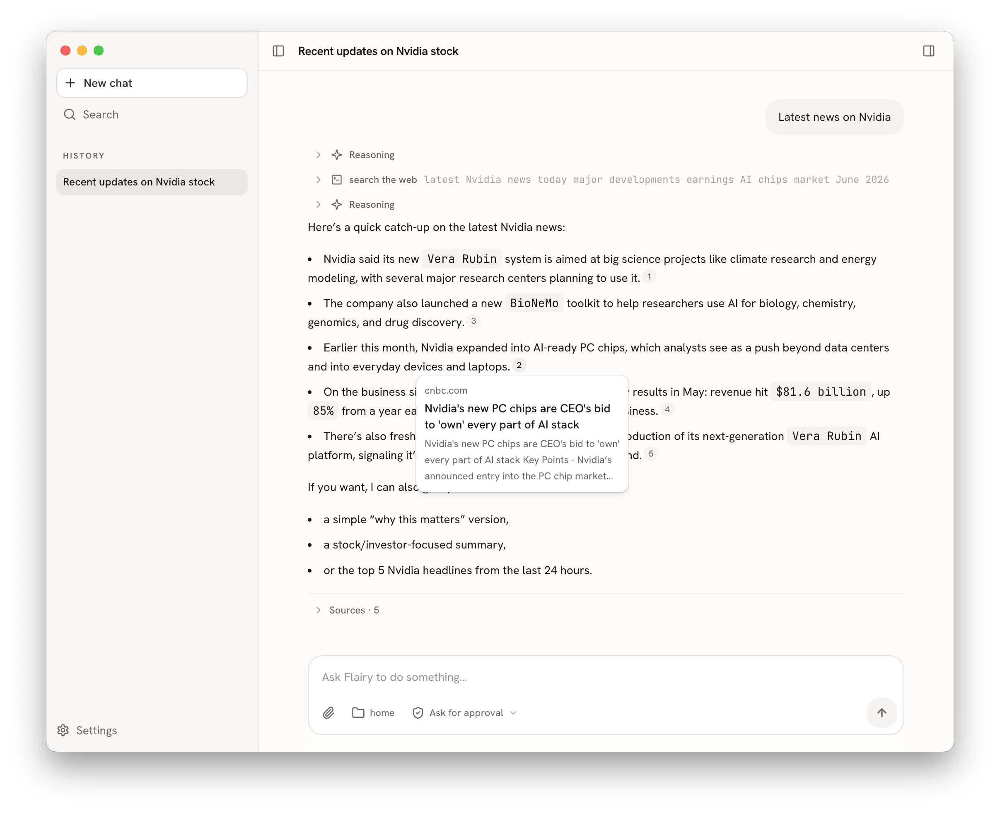

# Flairy

A desktop AI agent for **non-technical users**. Concepts like MCP, skills, models, and API keys are configured centrally on a server and pushed to clients in real time — so the app works out of the box with zero setup on the user side.


## Screenshot



## Highlights

- **Zero-config client** — administrators manage skills, MCP servers, LLM models, and credentials in an admin backend; clients receive everything over the wire.
- **Thick client, thin control plane** — the agent loop, local tools, and MCP all run on the client. The server delivers config and mirrors sessions; **LLM traffic never passes through it**.
- **Direct-to-provider LLM** — the client uses pushed credentials to call Anthropic / OpenAI / Google directly.
- **Multi-device session sync** — local-first sessions are mirrored to the server and pushed to your other devices over socket.io.
- **Credentials stay in the main process** — encrypted with Electron `safeStorage`; they never reach the renderer or hit disk in plaintext.

## Architecture

```
┌─ Client (Electron + React) ─────────────────────┐      ┌─ Server (Rust/Axum + React admin) ────┐
│  pi-agent-core (agent loop, local)               │      │  Admin Web UI (configure skills/MCP)   │
│  Local tools (fs / shell)                         │      │  User system / auth (Axum JWT)         │
│  MCP client (server-pushed MCP servers)           │◄────►│  Central config store + delivery        │
│  LLM: direct-connect via pushed config            │ s.io │  Session sync store (PostgreSQL)        │
│  Local cache (SQLite, offline-capable)            │      │  socketioxide (Axum / Tokio)            │
└─────────────────────────────────────────────────┘      └──────────────────────────────────────┘
        │ Direct connection to LLM provider
        ▼   Anthropic / OpenAI / Google ...
```

See [AGENTS.md](./AGENTS.md) for the full architecture, socket.io protocol, and config-delivery model.

## Monorepo Layout

A polyglot pnpm + Cargo workspace:

```
flairy/
├── apps/
│   ├── desktop/   # Electron client — electron-vite + React 19 + shadcn/ui
│   ├── server/    # Rust server — Axum REST + socketioxide, PostgreSQL/SQLx
│   └── admin/     # React admin web — Vite + TS + shadcn/ui
└── packages/
    └── shared/    # Shared TS contracts (desktop + admin), aligned with the server's serde structs
```

## Tech Stack

| Area | Stack |
|---|---|
| Desktop | Electron, electron-vite, React 19, shadcn/ui (Tailwind v4), Zustand, better-sqlite3/Drizzle |
| Agent | `@earendil-works/pi-agent-core` + `@earendil-works/pi-ai` |
| Server | Rust, Axum, socketioxide, SQLx + PostgreSQL, JWT auth |
| Admin | Vite, React, TypeScript, shadcn/ui |
| Realtime | socket.io (`socket.io-client` ↔ socketioxide) |

## Getting Started

Prerequisites: **Node 20+**, **pnpm**, and (for the server) **Rust** + a **PostgreSQL** database.

```bash
# Install TS workspace dependencies
pnpm install

# Build shared contracts (required before first dev/build)
pnpm build:shared

# Run the desktop client (HMR)
pnpm dev
```

Admin web:

```bash
pnpm --filter @flairy/admin dev
```

Server (Rust):

```bash
cd apps/server
cargo run            # see apps/server/README.md for DB setup & migrations
```

## Common Commands

```bash
pnpm dev            # desktop client with HMR
pnpm typecheck      # tsc across all TS workspaces
pnpm build          # build shared + desktop (packaging validation)
pnpm release        # release helper (scripts/release.mjs)
```

Per-package builds:

```bash
pnpm --filter @flairy/desktop build   # produce the Electron app (.dmg on macOS arm64)
pnpm --filter @flairy/admin build
```

## Contracts (Polyglot)

The server is Rust and can't import TS directly, so contracts are kept in sync by convention:

- **REST** — `utoipa` produces OpenAPI from Axum handlers → generate TS types for desktop/admin.
- **socket.io events / config / session models** — the server's **serde structs are the source of truth**; `packages/shared` mirrors them in TS. Change one side, sync the other, then rebuild `@flairy/shared`.

## License

MIT © eloxt
